# Mermaid Diagrams Demo

Mermaid diagrams are perfect for visualizing processes, workflows, and system architecture.

## Festival Setup Workflow

Here's a typical festival setup workflow using a Mermaid flowchart:

```mermaid
flowchart TD
    A[Create Festival Account] --> B[Choose Subscription Tier]
    B --> C[Set Festival Details]
    C --> D[Configure Stages]
    D --> E[Add Artists]
    E --> F[Build Schedule]
    F --> G[Setup Notifications]
    G --> H[Publish Festival]
    H --> I[Go Live! 🎪]
    
    style A fill:#7c3aed,stroke:#6d28d9,color:#fff
    style I fill:#8b5cf6,stroke:#7c3aed,color:#fff
```

## Festival Management System Architecture

## User Journey Timeline

Pretty awesome, right? These diagrams use the grape color scheme too! 🍇 